* Q : 异步转同步是如何实现的？通过下面的方法为啥就能立刻得到数据？  
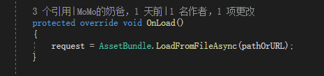  
A : 这是 Unity 的 API 的特性，异步加载没有完成的时候，如果访问了这个属性就会转为同步。
会让原有的异步加载立即完成，这是异步转同步的奥秘，这样异步可以当做同步来使用了。  
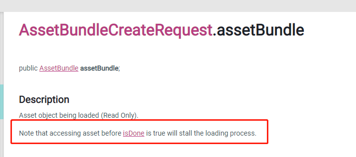  

* Q : 打包scene的时候会自动把scene里引用的资源打进去对吧，如果scene上挂了脚本，这个脚本会打进去吗，有些脚本没有挂在scene上会被打进去吗？  
A : bundle 里面不能打包代码，代码保存的是一些序列化信息。gameObject 的脚本是反序列化出来的。
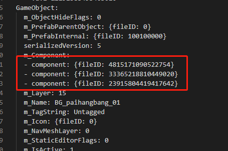  

* Q : xasset是如何解决重复加载和循环依赖的问题的？  
A : 循环依赖是代码分层问题,7.0 的依赖通过 Dependencies 类管理的。资源的依赖归属于 Asset，不归属于 Bundle。结构类似于下面：  
```
Asset
 - Dependencies
```
不是下面的这种结构：
```
Bundle
 - Dependencies
```
加载 Dependencies 的时候没有递归,不会死循环。是通过分层处理的，依赖关系放到 Asset 层，不是放到 Bundle 层。xasset的设计是 Bundle 自身没有依赖，Asset 有依赖，用 Asset 管理依赖，而不是用 Bundle 管理依赖，你看看 Bundle 类，有持有 Dependencies 么？分层就是不用 Bundle 管理依赖，因为依赖在 Bundle 层，天生有循序依赖，而依赖在 Asset 层，天生没有循环依赖。  

* Q : 请问怎么批量加载？  
A : 你对批量加载如何定义呢?onebyone 还是 并行？这都是在业务层控制的。  
```C#
foreach(var asset : assets) {
    var asset = Asset.Load(asset, assetType);
    yield return asset; 
}
```
上面这种是这是 onebyone 加载。  
```C#
var assets = new List<Asset>();
foreach(var path in assetPaths) {
    assets.Add(Asset.LoadAsync(path, type));
}
yield return new WaitForComplete(assets.TrueForAll(a => a.isDone));
```
这种写法是异步并行加载。  
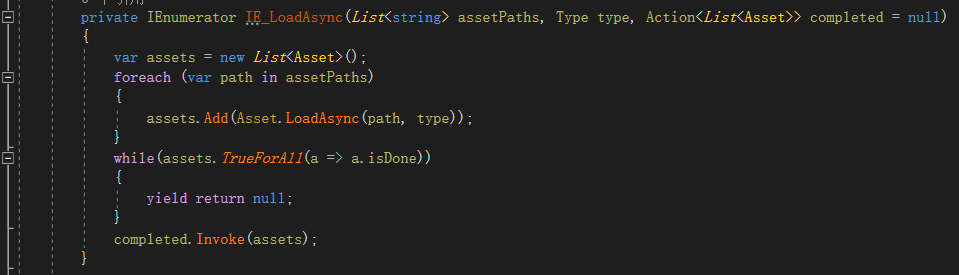  

* Q : 请问怎么打android包，怎么把shader打进去？  
A : 1.切换平台到 Android  
2.Assets/Versions/Build/Player 或者 File/Build XXX 都能打包 Android 包  
3.shader 分为两种，Unity 内部的配置到 allways include，其它的设置下 AssetBundle 名字  

* Q : 请问打包到安卓手机上，3d物体是紫色的什么情况?  
  A : shader 没有打包，或者变体采集，还有兼容性问题。shader 的问题，用 FrameDebuger 很好定位  

* Q:
  对于Build的Group拆分有什么建议吗？比如
  1.打包后，对大小超过多少的AB进行拆分成按文件打包？
  2.对于不同父节点的同名的文件夹如何处理？非PackTogether的情况下，Group.name是否可以重复？
  3.哪类文件适合单独一个ab，例如scene、所有的Shader
  4.在不修改当前Group的情况下，如何把Shader抽出来放到一个ab里(ustomPacker += CustomPacker实现)？
  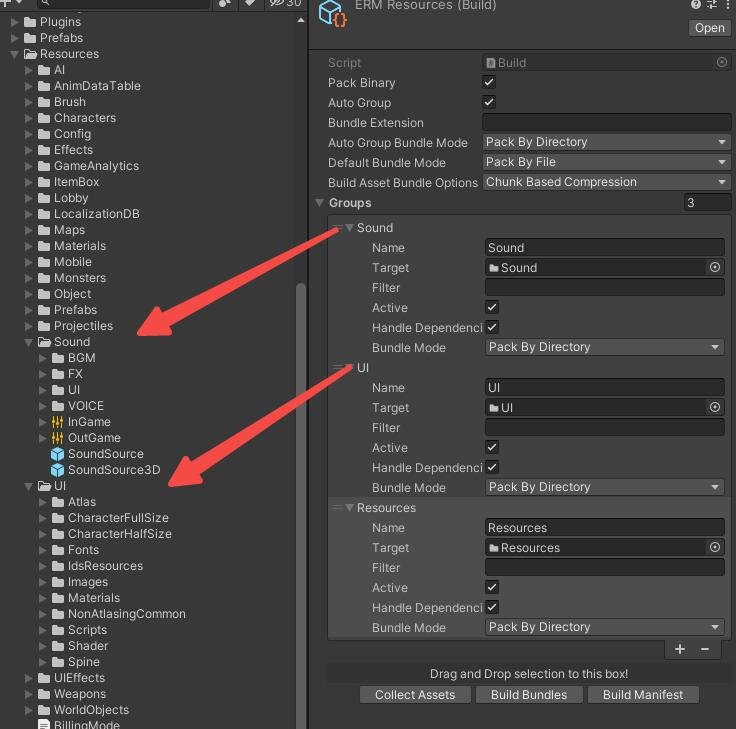  
  A:

  1.prefab、场景 之类可以 按文件打包。贴图之类 可以按目录打包、一个bundle 建议控制在 5MB 以内

  2.不同节点的同名的文件夹 不是 PackTogether 的 BundleMode 没影响。PackTogether 的建议不要重名，PackTogether 是根据 group.name 为采集的资源分配 ab。

  3.prefab、scene 之类比较适合 一个文件一个 ab

  4.不修改 Group 除了 CustomPacker 外还可以 修改资源目录实现 把shader 抽出来放到 一个 ab,shader 的最优打策略不是全部放到一个 ab,具体看项目体量了,所有资源都可以遵循 同时使用的 放到一起打包  

* Q : split build with group和blac klis tmode没看懂  
A:split 表示开启分包，基于 assetgroup 的配置，默认是白名单模式,
就是配置了啥就把啥复制到安装包。  

* Q : 这个黑名单模式有啥用？  
A:黑名单就是配置了的不复制到安装包的意思  

* Q : RawAsset是个啥概念?  
A:RawAsset就是不打进Bundle的资产文件，比如.mp4的视频文件
比如我这里有个.mp4文件,将它设置为了rawasset。打包的时候就是单纯地把他复制到StreamingAsset下 然后加载的时候用的是UnityWebRequest。  
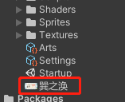  

* Q : assetgroup可以多个asset下一级目录打成一个bundle吗?build我理解是一种打所有bundle的方式,分包时是使用assetgroup而不是build是为啥？  
A:assetgroup 不是用来打 bundle 的,只是给 bundle 中的资源指定一个预定义的分组配置。这个分组配置在 demo 中用到了自定义安装包资源 和 按需更新上。  
Build 的 Group 用来采集要打包的资源，AssetGroup 用来定义 安装包中 需要包含的资源，另外 在运行时也用来 进行局部内容更新。  

* Q : 您好请问这个打出来的.bin是什么作用呢？为什么会有400M这么大呢？这个是压缩包的作用吗？进入游戏解压成ab？  
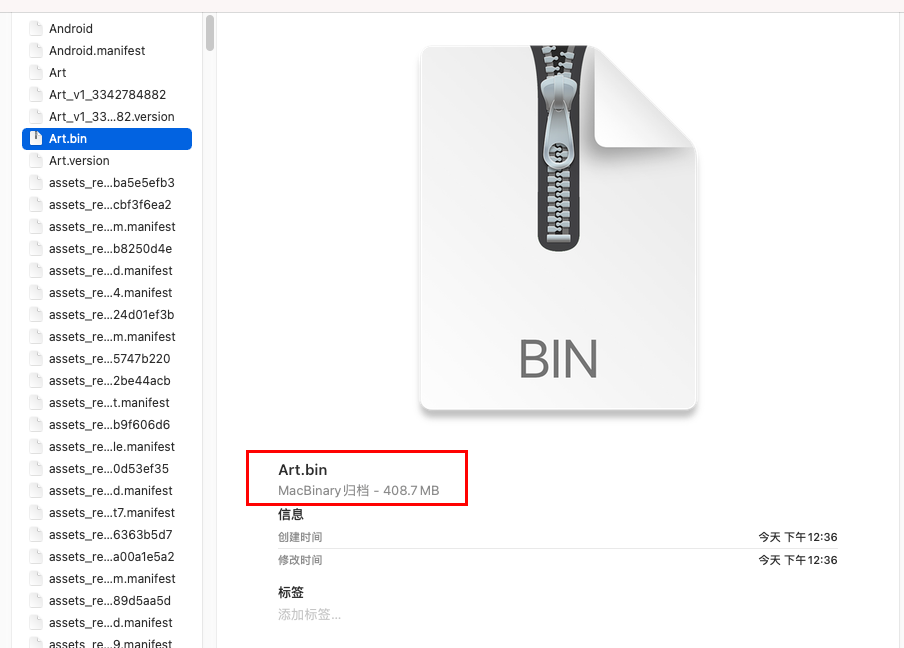  
A:bin是把所有的bundle合并到了一个block中,游戏中是直接按照偏移量去从这个bin文件中读取bundle的。文档中加密那一节有说这个，这个可以防止资源被轻易地解密、反向。  
对一个Build文件勾选pack binary以后，会在打Bundle的时候，把这个Build中包含的Bundle合并在一起放进一个同名的bin文件中，比如Art这个Build就会生成Art.bin，也就是你截图的那个。目前这个生成的跟Build同名的bin没有直接在游戏中使用到，是为了以后可以把某些模块的内容合并后一次更新下来 减少Http的IO，也就是下载一个大文件而不是多个小文件。  
勾选Setting中的BinaryMode：  
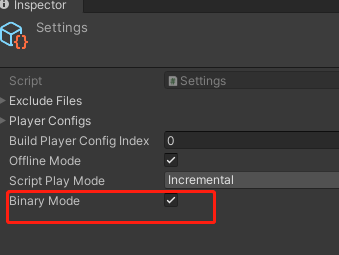  
这个会把所有的ab按照偏移量的方式，合并进一个大的名为data.bin的文件中，目前安装包加密是读取的data.bin这个，Build里的pack binary目前不开启不影响文档中所说的安装包加密功能。  
目前是所有的Bundle合并为一个data.bin，这块的代码在BuildScript.CopyToStreamingAssets这个函数里面实现的。  

* Q : 所有的Bundle都合并进data.bin的话是不是就没法做分包了呢？
A:安装包的bin是先分包后合并的。  

* Q : 请问build文件没有md5码，下载更新会不会有缓存问题?
A:有带 hash 的版本,example 里面的代码写了注释,正式环境使用 带 hash 的版本,如：Arts_v1_XXX。  
流程是这样的：  
1.打包，打完后把带 hash 的最新的配置文件上传到控制服后台  
2.客户端启动的时候 和 控制服 通信 获取这个带 hash 的配置文件  

* Q : 我在AssetGroup中只填Bundle中的其中一个Asset，调用GetDownloadSizeAsync(group)会返回包含这个Asset的整个Bundle对吧？  
A:会包含依赖,也是说我不用把Bundle里的每个Asset都配到AssetGroup里就可以达到下载整个Bundle或者让这个Bundle留在包体里的目的。另外，运行时的 AssetPath 其实有可能会随着角色的成长发生变化，所以 运行时可以不用 AssetGroup。  
例如，MMO 游戏中，同一个场景，老号和新号 需要的资源是不一样的，运行时根据角色数据 获取需要更新的资源 这个是最优的方式。xasset 在底层会自动处理依赖关系。  

* Q : 请问 现在version文件放在Application.temporaryCachePath这个目录，比较疑惑 如果清理缓存的话，会不会重新下载资源，还是基于有其他什么目的？  
A:临时目录保存的是临时文件;持久化目录保存的是正式文件  

* Q : 请问开启了binarymode后生成的data.bin是怎么用的呢？这个文件是留在包里还是放到cdn呢？  
A:打安装包会自动处理,不用上cdn。  

* Q : 那下载下来的ab是不是就没有加密功能了？  
A:下载的ab要分包就不能加密,不能用 现有的这种最高效的方案加密,边玩边下的时候天生会出现异常。  

* Q : 这三个选项是什么意思啊?  
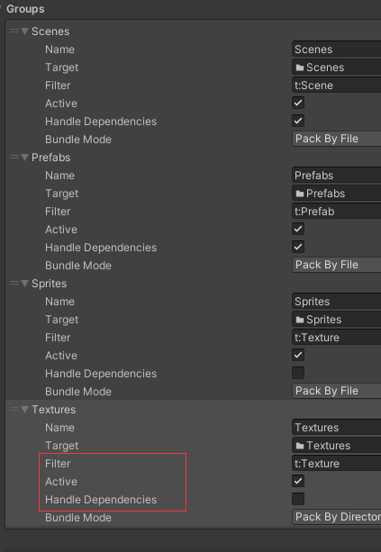  
A:  
Filter： 筛选,Filter 可以文档有描述  
Active: 启用  
Handle Dependencies 开启处理依赖，不带依赖的资源例如贴图，不勾选可以加快打包速度。  

* Q :  这个是什么样一个对应关系啊？  
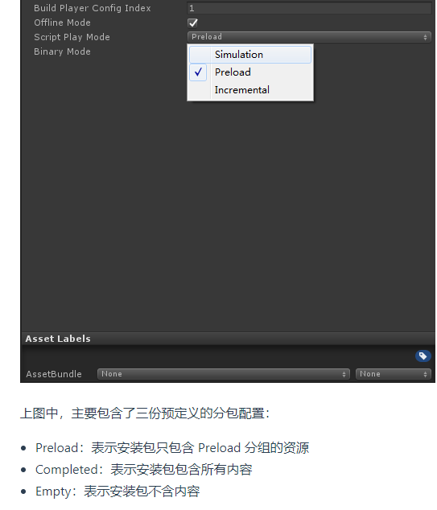  
A:BuildPlayerConfigIndex 决定 生效的配置，Preload、Completed、Empty 是预定义的安装包资源分组。  

* Q : 跑 7.0 example 里的 splash scene , PreloadManager 单例为空  
A:  
1.切换成 仿真模式跑  
2.打包后 切换为 预加载或者增量模式跑  

* Q : 生成的ab有1.5个G,但是最终生成的APK只有270MB，这是怎么回事？  
A:可能是分包导致的，Settings.PlayerConfigs的BuildPlayerConfigIndex设置，当BuildPlayerConfigIndex设置为0的时候，只有 Preload 部分的资源 Copy 到 StreamingAssets 了，分包机制生效了。在这种情况下，如果要打出整包，把BuildPlayerConfigIndex设置为1就可以。  
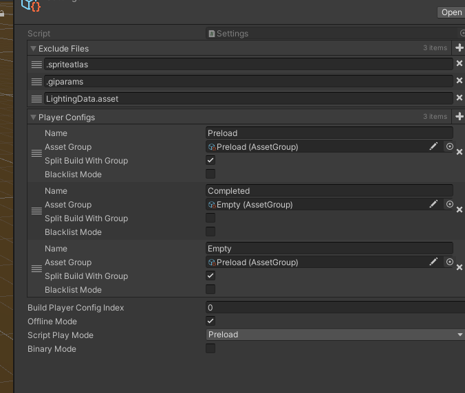  

* Q : maxbandwidth 是限速用的吗？  
A:是的  

* Q : 请问Group.asset 是另一个维度对资源的划分是嘛？  
A:AssetGroup.asset 是预定义的资源分组，算是另一个维度的，主要用来分包，以及 指定运行时需要 进行更新检查的资源（这个不是必须的）。example 用了 AssetGroup.asset 指定运行时局部更新的内容。  

* Q : Build.asset我已经按照分包下载的内容来划分了多个bundle， 如果还要在AssetGroup里根据不同功能罗列prefab和资源， 工作量比较大和有一定重复性。请问现在有对bundle的分组嘛？  
A:build 的 group 不应该 和 assetgroup 产生关系,build 决定资源的打包粒度,assetgroup 只是用来配置某一个时刻需要使用的资源,这是两个不同维度的东西。另外如果是 mmo，运行时 需要使用的资源可能会随角色等级变化而变化，这个时候动态组装资源路径比预定义更灵活、更准确。  

* Q : 还有个问题， 自动依赖我试了下会汇总到一个auto包下?  
A:这个是主动为未设置分组的资源,分配一个分组,可以避免打包冗余。  

* Q : 现在我们这边打bundle有一个需求，图集文件夹AtlasGroup希望能按照单个文件byfile打，其余的group希望按照together的方式打，我该怎么去设置build？  
A:BundleMode.PackByFile 就是按 file 打,Build 可以添加 n 个 Group,每个 Group 都有独立的 BundleMode。  

* Q : 一个ab对应一个group还是可以多个ab对应一个group？  
A:group 决定 对应资源 分配 到 ab 的粒度:
>* byfile = 每个资源 一个 ab  
>* together = 所有打包到 一个 ab  
>* by dir = 同一个目录的 一个 ab  
>* by top dir = 一级子目录的一个 ab  
一般 prefab 是 prefab 都放到一个 目录下，然后对 root 添加 一个 group，用 packByFile就好了。不用 每个文件夹都 创建一个 Group，Build 提供了一种 批处理的 采集资源 分配 bundle 的方式，带依赖的资源 勾选 Handle Dependenices，例如 prefab、scene、animation 之类，不带依赖的资源 例如 text texture audio video 等 可以不用勾选 HandleDependencies。  

* Q : XAsset目前对Google PAD的集成支持on-demand的模式么，我看文档上只提到了 install-time  
A : 支持,可以混用。on-demand 和 fast-follow 都是 从 assetPack 读取 bundle，打包 的时候自己分配 好 对应的 bundle 的 分发模式就好。  

* Q : 预加载和增量模式，这两个是要在windows平台下用吗？Android平台打出来的shader用不了  
A:真机默认增量模式,shader在android平台的编辑器下显示紫色是正常的。可以修改编辑器图形api，把 dx 改成 opengl。  

* Q : 现在setting里配置两种group， 一个是空包和一个是带了部分资源的， buildPlayerConfigIndex指定了带部分资源的这个group，所有资源我已经上传到本地服务器，真机打包出来都是正常的，但unity编辑器切换成 Incremental 模式就会提示FileNotFoundException。  
A : 编辑器中测试增量模式，先执行下CopyToStreamingAssets。增量模式下，资源从 StreamingAssets 加载。  

* Q : 如果我Build Player Config Index 指定为空的group， 这种情况也能模拟不？  
A : 可以，example 的 Startup 有个 autoUpdate 的选项，加载前只要装载了清单和配置好下载地址，资源服务器上有资源，本地没有的都会去服务器加载。  

* Q : 我现在也仿照 Startup 写了一个初始化脚本， 处理空包首次自动下和非空包只更新版本文件。只是updateAsync.Override()的时机现在不是很清楚， 虽然有注释。  
A ： Override 是业务之前有的客户说需要用旧版本的资源跑，example 里面有个对话框，让用户选择是否覆盖，用新版本的资源覆盖旧版本。不 Override 的时候，新的清单不会生效，Override 后新的清单才会生效。你的这两种情况其实就应该是都Override，哪怕不强制更新， 进入游戏后触发某个有资源更新的功能的时候， 就会弹资源更新提示框。
